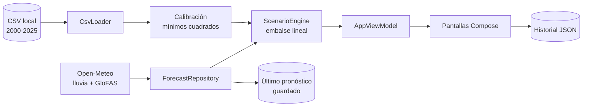

# HidroModel Tabasco

Simulador educativo de inundaciones para los ríos Grijalva y Usumacinta (Tabasco, México).
Convierte la lluvia acumulada en caudal de río y en riesgo de inundación, con un modelo calibrado con 26 años de datos.

Android nativo: Kotlin + Jetpack Compose (Material 3). Requiere Android 8.0 (API 26) o superior.


## Características principales
La app responde una pregunta sencilla: qué le pasa al río cuando llueve de cierta manera.

- Simula escenarios con deslizadores: intensidad y duración de la lluvia, lluvia previa, escurrimiento y retención de la cuenca.
- Visualiza el hidrograma (lluvia y caudal), un medidor de nivel del río y un semáforo de riesgo (Normal, Alerta, Crítico).
- Reproduce eventos históricos reales, como el pico del 7 de noviembre de 2020, y los compara con el caudal de referencia.
- Usa el pronóstico de lluvia actual (Open-Meteo) para proyectar el caudal de los próximos días.
- Guarda corridas en un historial y permite comparar dos de ellas.
- Funciona sin internet: los datos históricos viajan dentro de la app y el último pronóstico se guarda en el teléfono.


## Pantallas de la aplicación
| Pantalla | Archivo | Qué hace |
|---|---|---|
| Inicio | `ui/screens/HomeScreen.kt` | Resumen de datos, calibración por punto, evento de referencia (7 nov 2020) |
| Simular (configuración) | `ConfigScreen.kt` | Punto, lluvia manual o evento histórico, C, k, vista previa de riesgo, calibrar |
| Simulación | `SimulationScreen.kt` | Animación día a día: medidor de nivel, hidrograma con lluvia, 3 puntos |
| Resultados | `ResultsScreen.kt` | Pico, día del pico, días en alerta, R², diagnóstico, ventanas de lluvia, guardar |
| Historial | `HistoryScreen.kt` | Corridas guardadas (archivo JSON local) y comparación de dos |
| Datos históricos | `DataScreen.kt` | Serie 2000–2025 por punto/año, ranking de años en alerta |


## Modos de simulación de lluvia

| Modo | Origen de la lluvia | Uso |
|---|---|---|
| Manual | La define el usuario con los deslizadores | Responder "¿y si llueve 100 mm durante 3 días?" |
| Histórico | Lluvia real de un evento pasado | Validar el modelo contra lo ocurrido |
| Pronóstico | Pronóstico de Open-Meteo (por defecto 16 días, configurable) | Proyectar los próximos días |


## Modelo hidrológico

Embalse lineal de un solo almacenamiento (simulación de evento continuo):

$$Q_t = Q_{t-1} + \frac{g \cdot P_t - Q_{t-1}}{k}$$

- $P_t$: lluvia diaria (mm)
- $Q_t$: caudal (m³/s)
- $k$: constante de retención (días)
- $g$: ganancia (m³/s por cada mm/día sostenido)

**Calibración.** Mínimos cuadrados sobre 2000-2025. Para cada $k$ el modelo es lineal en $(Q_0, g)$, así que se resuelve en forma cerrada y se elige la $k$ con menor error. La app repite el ajuste al iniciar.

**Riesgo.** Alerta = percentil 95 y Crítico = percentil 99 del caudal histórico de cada punto.


### Puntos de monitoreo y calibración

| Punto | Caudal medio | Alerta (P95) | Crítico (P99) | k (días) | R² |
|---|---:|---:|---:|---:|---:|
| Grijalva - Villahermosa | 1,180 m³/s | 2,911 | 4,045 | 34.5 | 0.70 |
| Usumacinta - Emiliano Zapata | 2,364 m³/s | 5,271 | 7,046 | 29.3 | 0.82 |
| Usumacinta - Tenosique | 1,971 m³/s | 4,326 | 5,860 | 33.2 | 0.77 |

La metodología completa (sistema, datos, calibración, validación y limitaciones) está en [`MODELO.md`](MODELO.md).


## Arquitectura del sistema




## Organización del código
```
app/src/main/
├── assets/tabasco_lluvia_caudal.csv   # 28,491 registros diarios (3 puntos, 2000-2025)
└── java/com/hidromodel/tabasco/
    ├── model/       # modelos de datos, formato y textos del diagnóstico
    ├── hydro/       # embalse lineal, calibración y motor de escenarios
    ├── data/        # lector del CSV, pronóstico (red) e historial local
    ├── ui/          # tema, componentes, gráficas (Canvas) y pantallas
    └── AppViewModel.kt
```


## Instalación y ejecución

1. Instalar Android Studio (Koala 2024.1 o más reciente).
2. File > Open y elegir la carpeta del proyecto. Esperar el Gradle sync.
3. Ejecutar en un emulador o teléfono con Android 8.0 (API 26) o superior.

Si Android Studio reclama el wrapper de Gradle: Settings > Build > Gradle > Use Gradle from > `gradle-wrapper.properties`.

**Pruebas del modelo.** Clic derecho en `app/src/test` y Run Tests.

**Días de pronóstico.** Se ajustan con `FORECAST_DAYS` en `data/ForecastRepository.kt` (la API admite hasta 16).


## Fuentes de datos

| Dato | Fuente |
|---|---|
| Lluvia diaria histórica y pronóstico | [Open-Meteo](https://open-meteo.com) |
| Caudal diario de río (histórico y pronóstico) | [API de inundaciones de Open-Meteo](https://open-meteo.com/en/docs/flood-api), basada en GloFAS |

Weather data by [Open-Meteo.com](https://open-meteo.com).


## Limitaciones y advertencias

- El caudal es modelado (GloFAS), no medido por estaciones hidrométricas.
- Un solo punto de lluvia no representa toda la cuenca alta, por lo que el modelo subestima picos grandes (por ejemplo, unos 6,100 frente a unos 9,980 m³/s en el evento de 2020 en Emiliano Zapata).
- Las presas que regulan los ríos no están incluidas.
- Los umbrales de alerta son estadísticos, no cotas oficiales de inundación.
- El pronóstico de lluvia tiene incertidumbre, sobre todo en tormentas locales y a más días.

**Aviso.** Proyecto educativo. No emite alertas oficiales; para información real de riesgo, consultar a CONAGUA y a Protección Civil.


## Contexto académico

Proyecto desarrollado como evidencia de la asignatura Simuladores en Dispositivos Móviles (Ingeniería en Sistemas Computacionales, UJAT-DACYTI). Cubre simulación de eventos, visualización de datos, técnicas de predicción y metodología de modelado.


## Autor

MariaZZ-dev - [GitHub](https://github.com/MariaZZ-dev)